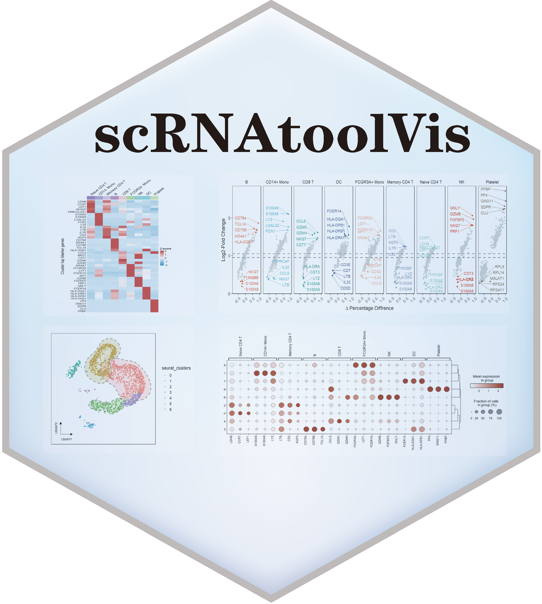

# scRNAtoolVis 
 Some useful function to make your scRNA-seq plot more beautiful.
 
 ## Installation

```R
install.packages('devtools')
devtools::install_github('junjunlab/scRNAtoolVis')

# if not install ggunchull
devtools::install_github("sajuukLyu/ggunchull", type = "source")

library(scRNAtoolVis)
```

## Citation

> Jun Z (2022). *scRNAtoolVis: Useful Functions to Make Your scRNA-seq Plot More Cool!.*  https://github.com/junjunlab/scRNAtoolVis, https://junjunlab.github.io/scRNAtoolVis-manual/.

## More examples see
> - https://junjunlab.github.io/scRNAtoolVis-manual/


